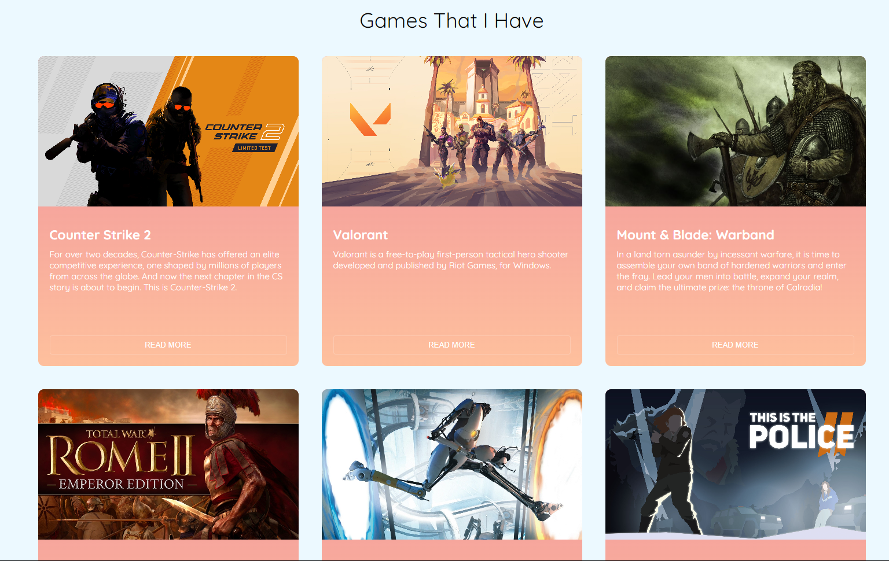

# Responsive Grid Layout Using Grid -  Games That I Have 

## Table of contents

- [Overview](#overview)
  - [Screenshot](#screenshot)
  - [Links](#links)
- [My process](#my-process)
  - [Built with](#built-with)
  - [Continued development](#continued-development)
- [Acknowledgments](#acknowledgments)

## Overview

### Screenshot

### Links

- Solution URL: [Add solution URL here](https://your-solution-url.com)
- Live Site URL: [Add live site URL here](https://your-live-site-url.com)

## My process

### Built with

- HTML
- CSS (Grid & Flexbox)
- Images: Google Images
- Font: [Quicksand](https://fonts.google.com/specimen/Quicksand)
- Colors: white, black, #ECF9FF, #EF8D9C, #FEC09D;

### Continued development

I would love to continue to improve my grid and flexbox skills. Also I want to improve my responsive skills.
I want to use best practices when building layouts, responsive layout and more!

## Acknowledgments

The idea of the grid layout was from [Codepen](https://codepen.io/mahmudulhrabby/pen/GGqdvr). 

